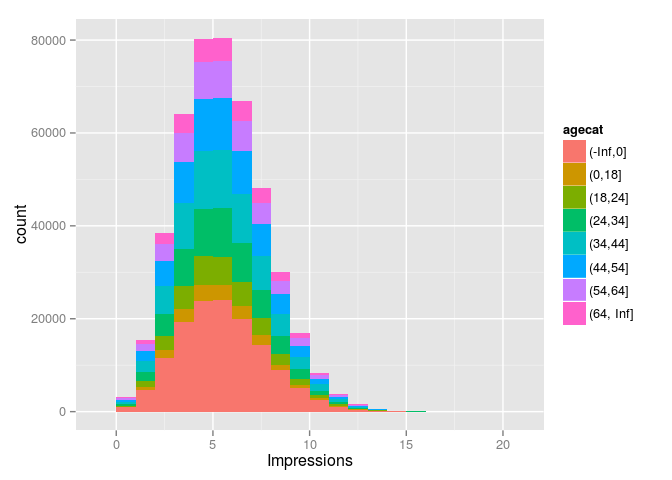
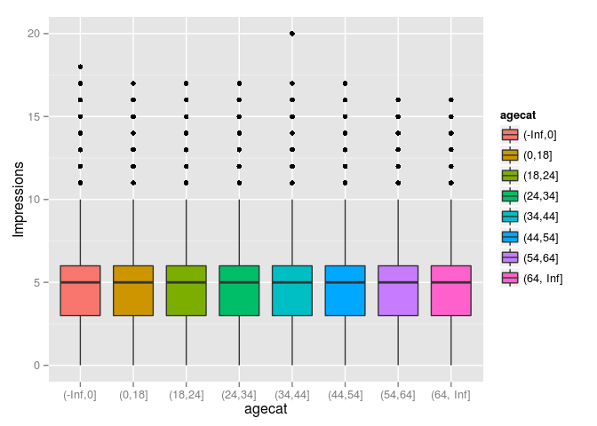
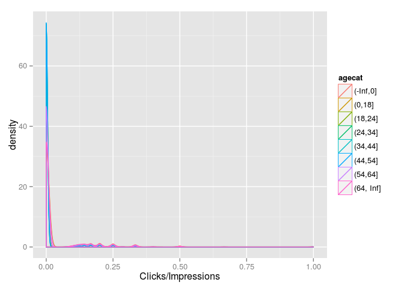
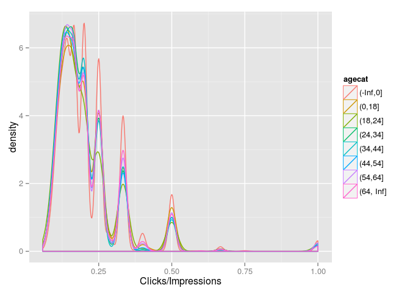
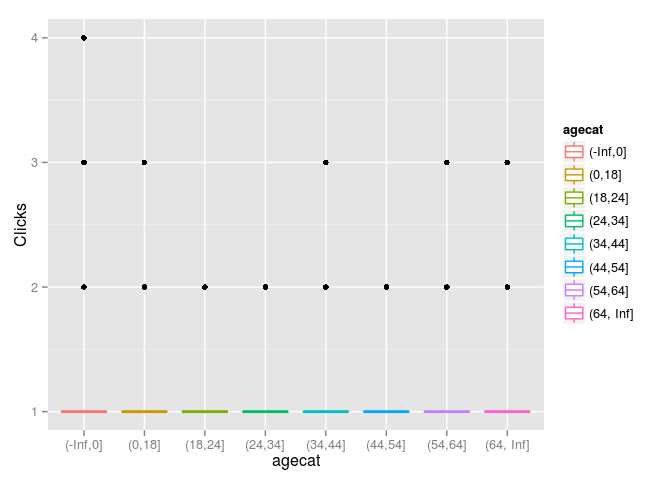
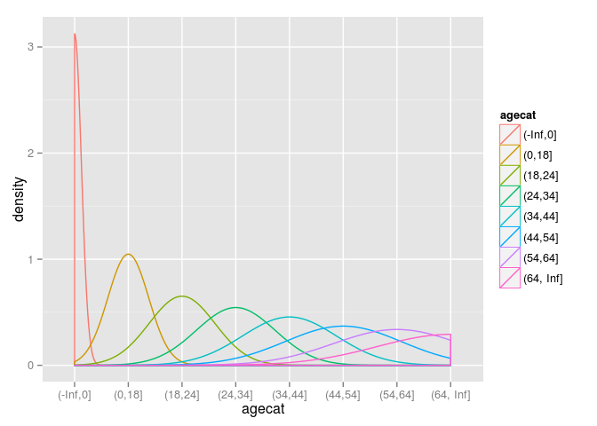

# 00_2. R 분석 예제 - 뉴욕 타임즈 홈페이지 광고 분석
김무성  
2015년 2월 23일  

---------------------------

# 목표
 * [1]의 예제. 2012년 5월 중 뉴욕타임즈 홈페이지에 기록된 하루 분량의 광고 노출횟수와 클릭 횟수를 담은 데이터
 * 다음을 분석한다(어느 특정 날짜. 이 문서에서는 nyt1.csv의 데이터만)
   - 사용자를 "<18", "18-24", "25-34", "35-44", "45-54", "55-64", "65+"로 범주화 하기
   - 6개 나이 범주에 대한 노출횟수와 클릭률(CTR)의 분포를 도표로 나타내기
   - 사용자들의 클릭 행동에 기반하여 그들을 분할하거나 범주화하는 새로운 변수를 정의
   - 데이터를 탐색하고, 사용자 세부 집단 혹은 인구통계적 집단을 시각적으로, 그리고 양적으로 비교
   - 데이터 요약하는 지표 산출


-----------------------------

# 분석
 * 데이터 읽기, 파악, 전처리
 * 사용자의 나이 범주화
 * 나이 범주에 대한 노출횟수와 클릭률 파악
 * 클릭 행동에 기반한 사용자 범주화
 

----------------------

### 데이터 읽기, 파악, 전처리

 * Age : 나이
 * Gender : 성별(0=여성, 1=남성)
 * Impressions : 노출횟수
 * Clicks : 클릭횟수
 * Signed_in : 로그인 횟수
 

```r
# 자료 소스 - https://github.com/oreillymedia/doing_data_science
data1 <- read.csv("./00_data/nytimes/nyt1.csv")

# 간략히 데이터 확인
head(data1)
```

```
##   Age Gender Impressions Clicks Signed_In
## 1  36      0           3      0         1
## 2  73      1           3      0         1
## 3  30      0           3      0         1
## 4  49      1           3      0         1
## 5  47      1          11      0         1
## 6  47      0          11      1         1
```

```r
# 데이터 변수들 확인
str(data1)
```

```
## 'data.frame':	458441 obs. of  5 variables:
##  $ Age        : int  36 73 30 49 47 47 0 46 16 52 ...
##  $ Gender     : int  0 1 0 1 1 0 0 0 0 0 ...
##  $ Impressions: int  3 3 3 3 11 11 7 5 3 4 ...
##  $ Clicks     : int  0 0 0 0 0 1 1 0 0 0 ...
##  $ Signed_In  : int  1 1 1 1 1 1 0 1 1 1 ...
```

```r
# 요약 통계 확인
summary(data1)
```

```
##       Age             Gender       Impressions         Clicks       
##  Min.   :  0.00   Min.   :0.000   Min.   : 0.000   Min.   :0.00000  
##  1st Qu.:  0.00   1st Qu.:0.000   1st Qu.: 3.000   1st Qu.:0.00000  
##  Median : 31.00   Median :0.000   Median : 5.000   Median :0.00000  
##  Mean   : 29.48   Mean   :0.367   Mean   : 5.007   Mean   :0.09259  
##  3rd Qu.: 48.00   3rd Qu.:1.000   3rd Qu.: 6.000   3rd Qu.:0.00000  
##  Max.   :108.00   Max.   :1.000   Max.   :20.000   Max.   :4.00000  
##    Signed_In     
##  Min.   :0.0000  
##  1st Qu.:0.0000  
##  Median :1.0000  
##  Mean   :0.7009  
##  3rd Qu.:1.0000  
##  Max.   :1.0000
```

----------------

### 사용자의 나이 범주화


```r
# 나이 범주화 하기 
data1$agecat <- cut(data1$Age, c(-Inf, 0, 18, 24, 34, 44, 54, 64, Inf))
head(data1)
```

```
##   Age Gender Impressions Clicks Signed_In    agecat
## 1  36      0           3      0         1   (34,44]
## 2  73      1           3      0         1 (64, Inf]
## 3  30      0           3      0         1   (24,34]
## 4  49      1           3      0         1   (44,54]
## 5  47      1          11      0         1   (44,54]
## 6  47      0          11      1         1   (44,54]
```

```r
summary(data1)
```

```
##       Age             Gender       Impressions         Clicks       
##  Min.   :  0.00   Min.   :0.000   Min.   : 0.000   Min.   :0.00000  
##  1st Qu.:  0.00   1st Qu.:0.000   1st Qu.: 3.000   1st Qu.:0.00000  
##  Median : 31.00   Median :0.000   Median : 5.000   Median :0.00000  
##  Mean   : 29.48   Mean   :0.367   Mean   : 5.007   Mean   :0.09259  
##  3rd Qu.: 48.00   3rd Qu.:1.000   3rd Qu.: 6.000   3rd Qu.:0.00000  
##  Max.   :108.00   Max.   :1.000   Max.   :20.000   Max.   :4.00000  
##                                                                     
##    Signed_In           agecat      
##  Min.   :0.0000   (-Inf,0]:137106  
##  1st Qu.:0.0000   (34,44] : 70860  
##  Median :1.0000   (44,54] : 64288  
##  Mean   :0.7009   (24,34] : 58174  
##  3rd Qu.:1.0000   (54,64] : 44738  
##  Max.   :1.0000   (18,24] : 35270  
##                   (Other) : 48005
```

```r
# 괄호로 묶기
# install.packages("doBy") # 패키지 설치. 한번만 설치하면 된다.
library(doBy) # 패키지 로딩
```

```
## Loading required package: survival
## Loading required package: splines
```

```r
siterange <- function(x){c(length(x), min(x), mean(x), max(x))}
summaryBy(Age~agecat, data = data1, FUN=siterange)
```

```
##      agecat Age.FUN1 Age.FUN2 Age.FUN3 Age.FUN4
## 1  (-Inf,0]   137106        0  0.00000        0
## 2    (0,18]    19252        7 16.03350       18
## 3   (18,24]    35270       19 21.26904       24
## 4   (24,34]    58174       25 29.50335       34
## 5   (34,44]    70860       35 39.49468       44
## 6   (44,54]    64288       45 49.49258       54
## 7   (54,64]    44738       55 59.49819       64
## 8 (64, Inf]    28753       65 72.98870      108
```

```r
# 로그인한 사용자에게만 나이와 성별 부여
summaryBy(Gender+Signed_In+Impressions+Clicks~agecat, data = data1, FUN=siterange)
```

```
##      agecat Gender.FUN1 Gender.FUN2 Gender.FUN3 Gender.FUN4 Signed_In.FUN1
## 1  (-Inf,0]      137106           0   0.0000000           0         137106
## 2    (0,18]       19252           0   0.6421151           1          19252
## 3   (18,24]       35270           0   0.5338531           1          35270
## 4   (24,34]       58174           0   0.5321621           1          58174
## 5   (34,44]       70860           0   0.5316963           1          70860
## 6   (44,54]       64288           0   0.5289790           1          64288
## 7   (54,64]       44738           0   0.5361885           1          44738
## 8 (64, Inf]       28753           0   0.3632664           1          28753
##   Signed_In.FUN2 Signed_In.FUN3 Signed_In.FUN4 Impressions.FUN1
## 1              0              0              0           137106
## 2              1              1              1            19252
## 3              1              1              1            35270
## 4              1              1              1            58174
## 5              1              1              1            70860
## 6              1              1              1            64288
## 7              1              1              1            44738
## 8              1              1              1            28753
##   Impressions.FUN2 Impressions.FUN3 Impressions.FUN4 Clicks.FUN1
## 1                0         4.999657               18      137106
## 2                0         4.998961               17       19252
## 3                0         5.006635               17       35270
## 4                0         4.993829               17       58174
## 5                0         5.021507               20       70860
## 6                0         5.010406               17       64288
## 7                0         5.022308               16       44738
## 8                0         5.012347               16       28753
##   Clicks.FUN2 Clicks.FUN3 Clicks.FUN4
## 1           0  0.14207985           4
## 2           0  0.13105132           3
## 3           0  0.04845478           2
## 4           0  0.05048647           2
## 5           0  0.05167937           3
## 6           0  0.05027377           2
## 7           0  0.10183736           3
## 8           0  0.15128856           3
```

```r
# install.packages("ggplot2")
library(ggplot2)
ggplot(data1, aes(x=Impressions, fill=agecat)) + geom_histogram(binwidth=1)
```

 

```r
ggplot(data1, aes(x=agecat, y=Impressions, fill=agecat)) + geom_boxplot()
```

 

---------------------------

### 나이 범주에 대한 노출횟수와 클릭률 파악


```r
# 클릭률 생성하기
# 만약 광고노출이 없다면 클릭에 대해 신경 쓰지 않는다.
# 만약 광고노출 없이 클릭이 존재한다면 이에 대한 내 가정은
# 이 데이터는 잘못된 것이다.
data1$hashimps <- cut(data1$Impressions, c(-Inf, 0, Inf))
head(data1)
```

```
##   Age Gender Impressions Clicks Signed_In    agecat hashimps
## 1  36      0           3      0         1   (34,44] (0, Inf]
## 2  73      1           3      0         1 (64, Inf] (0, Inf]
## 3  30      0           3      0         1   (24,34] (0, Inf]
## 4  49      1           3      0         1   (44,54] (0, Inf]
## 5  47      1          11      0         1   (44,54] (0, Inf]
## 6  47      0          11      1         1   (44,54] (0, Inf]
```

```r
summaryBy(Clicks~hasimps, data = data1, FUN=siterange)
```

```
##   Clicks.FUN1 Clicks.FUN2 Clicks.FUN3 Clicks.FUN4
## 1      458441           0  0.09259425           4
```

```r
# 광고 노출이 0 이상인 자료 중에서, CRT(Click-Throught-Rate=#clikcs/#impressions)
ggplot(subset(data1, Impressions>0), aes(x=Clicks/Impressions, colour=agecat)) + geom_density()
```

 

```r
# 클릭이 0 이상인 자료 중에서 연령범주별, CRT 분포
ggplot(subset(data1, Clicks>0), aes(x=Clicks/Impressions, colour=agecat)) + geom_density()
```

 

```r
# 클릭이 0 이상인 자료 중에서 연령범주별, 클릭 
ggplot(subset(data1, Clicks>0), aes(x=agecat, y=Clicks, colour=agecat)) + geom_boxplot()
```

 

```r
# 클릭이 0 이상인 자료 중에서 연령범주별, 클릭 
ggplot(subset(data1, Clicks>0), aes(x=agecat, colour=agecat)) + geom_density()
```

 

---------------------------

### 클릭 행동에 기반한 사용자 범주화


```r
head(data1)
```

```
##   Age Gender Impressions Clicks Signed_In    agecat hashimps
## 1  36      0           3      0         1   (34,44] (0, Inf]
## 2  73      1           3      0         1 (64, Inf] (0, Inf]
## 3  30      0           3      0         1   (24,34] (0, Inf]
## 4  49      1           3      0         1   (44,54] (0, Inf]
## 5  47      1          11      0         1   (44,54] (0, Inf]
## 6  47      0          11      1         1   (44,54] (0, Inf]
```

```r
# 범주화 하기 
data1$scode[data1$Impressions==0] <- "NoImps"
data1$scode[data1$Impressions>0] <- "Imps"
data1$scode[data1$Clicks>0] <- "Clicks"
head(data1)
```

```
##   Age Gender Impressions Clicks Signed_In    agecat hashimps  scode
## 1  36      0           3      0         1   (34,44] (0, Inf]   Imps
## 2  73      1           3      0         1 (64, Inf] (0, Inf]   Imps
## 3  30      0           3      0         1   (24,34] (0, Inf]   Imps
## 4  49      1           3      0         1   (44,54] (0, Inf]   Imps
## 5  47      1          11      0         1   (44,54] (0, Inf]   Imps
## 6  47      0          11      1         1   (44,54] (0, Inf] Clicks
```

```r
str(data1)
```

```
## 'data.frame':	458441 obs. of  8 variables:
##  $ Age        : int  36 73 30 49 47 47 0 46 16 52 ...
##  $ Gender     : int  0 1 0 1 1 0 0 0 0 0 ...
##  $ Impressions: int  3 3 3 3 11 11 7 5 3 4 ...
##  $ Clicks     : int  0 0 0 0 0 1 1 0 0 0 ...
##  $ Signed_In  : int  1 1 1 1 1 1 0 1 1 1 ...
##  $ agecat     : Factor w/ 8 levels "(-Inf,0]","(0,18]",..: 5 8 4 6 6 6 1 6 2 6 ...
##  $ hashimps   : Factor w/ 2 levels "(-Inf,0]","(0, Inf]": 2 2 2 2 2 2 2 2 2 2 ...
##  $ scode      : chr  "Imps" "Imps" "Imps" "Imps" ...
```

```r
# scode의 자료형을 factor로 변환하기
data1$scode <- factor(data1$scode)
head(data1)
```

```
##   Age Gender Impressions Clicks Signed_In    agecat hashimps  scode
## 1  36      0           3      0         1   (34,44] (0, Inf]   Imps
## 2  73      1           3      0         1 (64, Inf] (0, Inf]   Imps
## 3  30      0           3      0         1   (24,34] (0, Inf]   Imps
## 4  49      1           3      0         1   (44,54] (0, Inf]   Imps
## 5  47      1          11      0         1   (44,54] (0, Inf]   Imps
## 6  47      0          11      1         1   (44,54] (0, Inf] Clicks
```

```r
str(data1)
```

```
## 'data.frame':	458441 obs. of  8 variables:
##  $ Age        : int  36 73 30 49 47 47 0 46 16 52 ...
##  $ Gender     : int  0 1 0 1 1 0 0 0 0 0 ...
##  $ Impressions: int  3 3 3 3 11 11 7 5 3 4 ...
##  $ Clicks     : int  0 0 0 0 0 1 1 0 0 0 ...
##  $ Signed_In  : int  1 1 1 1 1 1 0 1 1 1 ...
##  $ agecat     : Factor w/ 8 levels "(-Inf,0]","(0,18]",..: 5 8 4 6 6 6 1 6 2 6 ...
##  $ hashimps   : Factor w/ 2 levels "(-Inf,0]","(0, Inf]": 2 2 2 2 2 2 2 2 2 2 ...
##  $ scode      : Factor w/ 3 levels "Clicks","Imps",..: 2 2 2 2 2 1 1 2 2 2 ...
```

```r
# 요인(factor)의 수준(level) 확인하기
clen <- function(x){c(length(x))}
etable <- summaryBy(Impressions~scode+Gender+agecat, data=data1, Fun=clen)
etable
```

```
##     scode Gender    agecat Impressions.mean
## 1  Clicks      0  (-Inf,0]         5.922480
## 2  Clicks      0    (0,18]         5.881797
## 3  Clicks      0   (18,24]         5.985879
## 4  Clicks      0   (24,34]         5.923586
## 5  Clicks      0   (34,44]         5.996418
## 6  Clicks      0   (44,54]         5.985274
## 7  Clicks      0   (54,64]         5.973579
## 8  Clicks      0 (64, Inf]         6.006928
## 9  Clicks      1    (0,18]         5.938361
## 10 Clicks      1   (18,24]         6.092135
## 11 Clicks      1   (24,34]         5.944997
## 12 Clicks      1   (34,44]         6.022431
## 13 Clicks      1   (44,54]         6.025532
## 14 Clicks      1   (54,64]         5.990991
## 15 Clicks      1 (64, Inf]         5.991252
## 16   Imps      0  (-Inf,0]         4.900339
## 17   Imps      0    (0,18]         4.917014
## 18   Imps      0   (18,24]         5.001352
## 19   Imps      0   (24,34]         4.991436
## 20   Imps      0   (34,44]         4.994567
## 21   Imps      0   (44,54]         4.996254
## 22   Imps      0   (54,64]         4.952056
## 23   Imps      0 (64, Inf]         4.898941
## 24   Imps      1    (0,18]         4.900595
## 25   Imps      1   (18,24]         4.986129
## 26   Imps      1   (24,34]         4.967272
## 27   Imps      1   (34,44]         5.011123
## 28   Imps      1   (44,54]         4.994773
## 29   Imps      1   (54,64]         4.953858
## 30   Imps      1 (64, Inf]         4.867897
## 31 NoImps      0  (-Inf,0]         0.000000
## 32 NoImps      0    (0,18]         0.000000
## 33 NoImps      0   (18,24]         0.000000
## 34 NoImps      0   (24,34]         0.000000
## 35 NoImps      0   (34,44]         0.000000
## 36 NoImps      0   (44,54]         0.000000
## 37 NoImps      0   (54,64]         0.000000
## 38 NoImps      0 (64, Inf]         0.000000
## 39 NoImps      1    (0,18]         0.000000
## 40 NoImps      1   (18,24]         0.000000
## 41 NoImps      1   (24,34]         0.000000
## 42 NoImps      1   (34,44]         0.000000
## 43 NoImps      1   (44,54]         0.000000
## 44 NoImps      1   (54,64]         0.000000
## 45 NoImps      1 (64, Inf]         0.000000
```

---------------------------


# 참고문헌
 * [1] Doing Data Science - http://shop.oreilly.com/product/0636920028529.do
