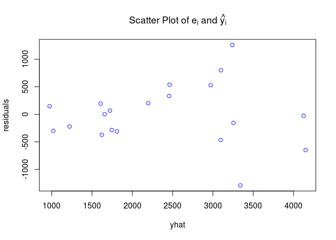

# 00_4. R 분석 예제 - 서울의 아파트 가격 분석
김무성  
2015년 2월 23일  


---------------------------

# 목표

* [1]의 예제. 서울의 아파트 평당 가격에 영향을 미치는 변수들을 설정하여 조사한 결과 아래 형태과 같은 자료를 얻었다. 

아파트 평당 가격(P, 단위: 만원)  | 아파트 연령(Y) | 지하철까지의 거리(D, 단위: Km)  | 위치 더미(강남이면 1, 아니면 0)
------------- | ------------  | ------------- | -------------
  1500    | 10  | 1  | 0
  1120    | 2  | 5.5  | 0
  1800    | 3  | 1.2  | 0
  3000    | 39  | 1.5  | 0


-----------------------------

# 분석 
   (1) 아파트 연령(Y), 강남 위치 여부(L), 지하철까지의 거리(D)가 아파트 평당 가격(P)에 미치는 영향을 알아보기 위해 다중회귀모형을 OLS 추정량으로 추정해보라.
   (2) 5% 유의수준을 이용하여 각 계수에 대한 유의성 검정을 수행하여라.
   (3) 잔차와 아파트 평당 가격의 예측값에 대한 산포도를 그려보고, 이분산 존재 여부를 판단해보아라.
   (4) 이 회귀모형에 대한 BPG 검정통계량을 계산하였을 때 10%의 유의수준에서 이분산이 존재한다고 판단할 수 있는가?
   (5) 이 모형에 이분산이 존재한다면 그 이유를 어떻게 설명할 수 있는가?
   (6) White의 이분산-일치 추정량을 이용하여 표준오차를 계산하고 5% 유의수준을 이용하여 각 계수에 대한 유의성 검정을 수행하여라.OLS를 적용하여 계산한 2번의 결과와 어떤 차이가 있는가?
 

----------------------

### 데이터 읽기, 파악, 전처리

 * price : 아파트 평당 가격(P), 단위: 만원
 * year : 아파트 연령(Y)
 * distance : 지하철까지의 거리(D)
 * D : 위치 더미(강남이면 1, 아니면 0)
 
 

```r
apt <- read.table('00_data/apt/Apartment.txt', header=T)
head(apt)
```

```
##   price year distance D
## 1  1500   10      1.0 0
## 2  1120    2      5.5 0
## 3  1800    3      1.2 0
## 4  3000   39      1.5 0
## 5  4100   37      0.3 1
## 6  3100    1      0.1 1
```

```r
str(apt)
```

```
## 'data.frame':	20 obs. of  4 variables:
##  $ price   : int  1500 1120 1800 3000 4100 3100 3900 2050 1460 1250 ...
##  $ year    : int  10 2 3 39 37 1 1 5 4 7 ...
##  $ distance: num  1 5.5 1.2 1.5 0.3 0.1 1.2 0.2 0.4 1.8 ...
##  $ D       : int  0 0 0 0 1 1 1 1 0 0 ...
```

```r
summary(apt)
```

```
##      price           year          distance           D      
##  Min.   : 720   Min.   : 1.00   Min.   :0.100   Min.   :0.0  
##  1st Qu.:1490   1st Qu.: 1.75   1st Qu.:0.300   1st Qu.:0.0  
##  Median :2225   Median : 4.50   Median :1.200   Median :0.0  
##  Mean   :2388   Mean   :11.65   Mean   :1.560   Mean   :0.4  
##  3rd Qu.:3200   3rd Qu.:17.50   3rd Qu.:1.875   3rd Qu.:1.0  
##  Max.   :4500   Max.   :39.00   Max.   :5.500   Max.   :1.0
```

----------------

### (1) 아파트 연령(Y), 강남 위치 여부(L), 지하철까지의 거리(D)가 아파트 평당 가격(P)에 미치는 영향을 알아보기 위해 다중회귀모형을 OLS 추정량으로 추정해보라.


```r
apt.res <- lm(price ~year+distance+D , data =apt)
summary(apt.res)
```

```
## 
## Call:
## lm(formula = price ~ year + distance + D, data = apt)
## 
## Residuals:
##      Min       1Q   Median       3Q      Max 
## -1290.75  -301.65   -10.65   234.95  1259.07 
## 
## Coefficients:
##             Estimate Std. Error t value Pr(>|t|)    
## (Intercept)  1701.09     345.67   4.921 0.000153 ***
## year           24.95      10.70   2.332 0.033089 *  
## distance     -141.38     104.92  -1.347 0.196595    
## D            1543.17     314.39   4.909 0.000157 ***
## ---
## Signif. codes:  0 '***' 0.001 '**' 0.01 '*' 0.05 '.' 0.1 ' ' 1
## 
## Residual standard error: 601.7 on 16 degrees of freedom
## Multiple R-squared:  0.7572,	Adjusted R-squared:  0.7117 
## F-statistic: 16.64 on 3 and 16 DF,  p-value: 3.565e-05
```

---------------------------

### (2) 5% 유의수준을 이용하여 각 계수에 대한 유의성 검정을 수행하여라.

각 계수의 t- 검정통계량은 4.921(P-value : 0.0002) , 2.332(P-value : 0.0331), -1.347(P-value : 0.1966) , 4.909(P-value : 0.0000)로 지하철 거리 변수를 제외한 나머지 변수들은 5% 유의수준에서 통계적으로 유의미하다.


---------------------------

### (3) 잔차와 아파트 평당 가격의 예측값에 대한 산포도를 그려보고, 이분산 존재 여부를 판단해보아라.


```r
# 잔차 추출
residuals<-resid(apt.res)

# 종속변수의 예측값
yhat <- predict(apt.res, interval ="none")

# 산포도
plot(x=yhat, y=residuals, col="blue", main=expression(list("Scatter Plot of"~e[i]~and~hat(y[i]))))
```

 

그래프에 의하면 평당 아파트 가격 변수의 예측값이 커질수록 잔차의 분산이 커지는 경향이 나타난다. 이는 회귀모형에 이분산이 존재함을 의미한다.

---------------------------

### (4) 이 회귀모형에 대한 BPG 검정통계량을 계산하였을 때 10%의 유의수준에서 이분산이 존재한다고 판단할 수 있는가?


```r
#install.packages("lmtest")
library(lmtest)
```

```
## Loading required package: zoo
## 
## Attaching package: 'zoo'
## 
## The following objects are masked from 'package:base':
## 
##     as.Date, as.Date.numeric
```

```r
bptest(apt.res)
```

```
## 
## 	studentized Breusch-Pagan test
## 
## data:  apt.res
## BP = 6.8867, df = 3, p-value = 0.0756
```

BPG 검정통계량은 6.8867이며 계산된 P-value는 0.0756이다. 따라서 10% 유의수준에서 동분산 귀무가설은 기각되어 회귀모형에 이분산이 존재한다고 판단할 수 있다.

---------------------------

### (5) 이 모형에 이분산이 존재한다면 그 이유를 어떻게 설명할 수 있는가?

아파트 연령이 증가할수록 평당 아파트 가격의 변동성이 커지기 때문이다. 즉, 아파트가 오래될수록 가치가 하락하여 평당 아파트 가격이 낮아지지만 아파트가 오래되어 재개발 혹은 재건축이 예정된 아파트는 오히려 평당 아파트 가격이 폭등하는 현상으로 인해 잔차의 분산이 증가하는 이분산이 발생하게 된다.


---------------------------

### (6) White의 이분산-일치 추정량을 이용하여 표준오차를 계산하고 5% 유의수준을 이용하여 각 계수에 대한 유의성 검정을 수행하여라.OLS를 적용하여 계산한 2번의 결과와 어떤 차이가 있는가?


```r
#install.packages("sandwich")
library(sandwich)

# beta^의 공분산 행렬
cov.mat <- vcovHC(apt.res, type="HC")
cov.mat
```

```
##             (Intercept)        year    distance          D
## (Intercept)   54076.651 -1708.36605 -13255.8384  4302.6851
## year          -1708.366    88.21732    366.6881  -640.6167
## distance     -13255.838   366.68805   4082.1306 -1442.1284
## D              4302.685  -640.61672  -1442.1284 66625.3269
```

```r
library(lmtest)
# 회귀계수의 유의성 검정
coeftest(apt.res, vcov=cov.mat)
```

```
## 
## t test of coefficients:
## 
##              Estimate Std. Error t value  Pr(>|t|)    
## (Intercept) 1701.0851   232.5439  7.3151 1.736e-06 ***
## year          24.9532     9.3924  2.6567   0.01723 *  
## distance    -141.3835    63.8916 -2.2129   0.04179 *  
## D           1543.1710   258.1188  5.9785 1.929e-05 ***
## ---
## Signif. codes:  0 '***' 0.001 '**' 0.01 '*' 0.05 '.' 0.1 ' ' 1
```

화이트의 이분산-일치 추정량을 이용하여 표준오치를 계산한 결과에 의하면 모든 계수에 대한 표준오차가 감소하여 t-검정통계량이 증가하였다. OLS추정 결과에 의해 5% 유의수준에서 통계적으로 유의성이 없었던 지하철 거리 변수도 유의성이 있는 것으로 나타난다.


---------------------------


# 참고문헌
 * [1] 응용 계량경제학 - R 활용 - http://www.kyobobook.co.kr/product/detailViewKor.laf?mallGb=KOR&ejkGb=KOR&barcode=9788968660696
