06. R 언어 기초
========================================================

* 코난아카데미 : 데이터분석 기초
* 작성자 : 김무성

--------------------------------------------------------

차례
========================================================

* R 기초 
  

--------------------------------------------------------


R 기초 
=========================================================

* 설치 & 환경
* 표현식과 명령문[1]
* 구문법칙[1]
* 객체의 속성[1]
* 데이터의 형태[1]
* R의 주요 연산자와 함수[1]
* 자료의 입력 및 출력[1]
* 제어문, 연산, 함수[2]
* 클래스[3]
* apply 함수들[2]
* 기타 자주 쓰는 유용한 함수들 [2]


--------------------------------------------------------

설치 & 환경
=========================================================
* R - http://www.r-project.org/
* RStudio - http://www.rstudio.com/
* RMarkdown - https://support.rstudio.com/hc/en-us/articles/200552086-Using-R-Markdown?version=0.98.490&mode=server


--------------------------------------------------------


표현식과 명령문
=========================================================
* 표현식(Expression)
* 명령문(Statement)

## 표현식(Expression)

표현식은 사용자가 원하는 작업 내용을 컴퓨터가 받아들여 수행할 수 있도록 하는 단위명령들의 조합.

```
> 25+15*5
> Y=C+I+G+(X-M)
> season <- c("spring", "smummer", "fail", "winter")
```

## 명령문(Statement)

* 명령문은 표현식이나 명령어의 조합으로 이루어진다.
* R에서 명령문은 크게 2가지로 구분된다.
  + 직접 명령문
  + 할당 명령문
  
### 직접 명령문

* 직접 명령문(direct statement)은 컴퓨터에게 사용자가 원하는 작업을 명령하고 컴퓨터가 수행한 작업의 결과를 즉시 반환하도록 요구하는 명령문의 형태이다.
* 입력된 명령문은 결과값을 반환할 뿐 R의 작업공간(Workspace) 내부에 저장되지 않는다.
* 할당 명령문을 제외하고 모두 직접 명령문이다. 

#### 직접 명령문 예제

```{r}
25*3/13
print(25*3/13, digits=10)
```

### 할당 명령문

* 할당 명령문(assignment statement)은 특정한 데이터 혹은 연산 결과를 새로운 문자열에 할당하여 하나의 객체를 정의하는 명령문이다.
* 직접 명령문과 달리 작업 결과의 반환을 요구하지 않는다.
* 할당 명령문의 ㅎ여태는 크게 두 가지이다.
  + 할당 연산자 이용
  + 할당 함수 assign() 이용
  
#### 할당문 예제  

```{r}
x <- c(1,2,3,4,5,6,7,8,9,10)
x
assign("x", c(1,2,3,4,5,6,7,8,9,10))
x
c("USA", "Japan", "UK", "France", "Germany", "Italy", "Canada") -> G7
G7
assign("G7", c("USA", "Japan", "UK", "France", "Germany", "Italy", "Canada"))
G7
```

--------------------------------------------------------

구문법칙
=========================================================

* 구문법칙(rules of syntax)은프로그래밍 언어에서 명령문의 구조를 지배하는 법칙이다.
  
1. 식별자(Identifier)
2. 명령문
3. 참조문(Comment)
4. 함수의 인수(Function argument)
5. 벡터 및 행렬의 지표(Index matirx)  

## 식별문자

* 문자열에 어떤 의미가 할당되에 연산이나 프로그래밍 과정에 그 실체를 인식하기 위한 낱말이 되면 이것은 식별문자가 된다.
* 식별문자는 보통 알파벳(A~Z, a~z)과 숫자(0~9)의 조합으로 이루어지며, 마침표(',') 혹은 밑줄문자('_')를 함께 사용할 수 있다.
* 간격문자는 포함될 수 없다
* 식별문자의 첫 글자로 숫자나 밑줄문자를 사용할 수 없다.
* 마침표를 첫 글자를 사용하더라도 다음에 오는 문자로 숫자는 사용할 수 없다.(소수점으로 인식함)
* 한글과 밑줄문자는 가급적 식별문자로 사용하지 말자
* R은 식별자의 대문자와 소문자를 구분
* 식별자는 오직 하나만. 동일한 식별 문자에 여러번 서로 다른 내용을 할당하면 그때마다 새 값이 할당된다(덮어쓰기). 

```
> a b <- c(1,2,3,4,5) # 잘못된 식별문자
> 1a <- c(1,2,3,4,5)
> _a <- c(1,2,3,4,5)
> .1 <- c(1,2,3,4,5)
```

## 명령문

#### 기본적으로 단일 명령문은 표현식을 입력한 후 Enter 키를 누르는 것을 실행. 여러 명령문은 행으로 구분됨. 
```{r}
A <- c(1,2,3,4,5)
A
25+15*5
```

#### 두 가지 이상의 명령문을 한 행에 동시에 입력하고자 하면, 세미콜론 사용.
```{r}
A; 25+15*5
```

* 명령문의 입력은 완전한 형태를 갖추기 전까진 종료되지 않는다.


## 참조문(Comment)

* (보통 주석문이라고 많이 부른다)
* 단일 행에서 '#' 기호 뒤에 입력된 명령문은 R에서 인식되지 않고 실행되지 않는다. 
* 인간을 위한 참조문을 삽입할 때 사용한다. 

#### 참조문(주석문) 예제

```{r}
# 이 문장은 실행되지 않는다. 2+5
print(2+5) # 2+5의 결과를 출력한다.
```

```{r}
# nominal National Disposable Income
# 통계청으로부터 수집된 2001년부터 2010년까지 우리나라의 연도별 명목 국민총처분가능소득(단위 : 십억 원) 관측값이다.
nominal.NDI <- c(649420, 719019, 764327, 826544, 861886, 906278, 973520, 1033947, 1069156, 1169392)

# Consumer Price Index
# 같은 기간의 우리나라 소비자 물가 지수(2010=100) 관측값이다.
CPI <- c(76.08, 78.18, 80.92, 83.83, 86.14, 88.07, 90.30, 94.52, 97.13, 100)

# real National Disposable Income
# 실질 국민총처분가능호득은 명목 국민총처분가능호득을 소비자 물가지수로 나눈 값에 100을 곱하여 계산할 수 있다.
rNDI = (nominal.NDI / CPI) * 100
rNDI # print rNDI
```

## 함수의 인수(Function argument)

* 함수에 사용되는 인수(argument)는 함수의 기능을 보다 세밀하게 조정하는 옵션으로, 소괄호('()')로 묶어서 사용하게 된다.

```
> cor(x, y, use, method=c("pearson", "kendall", "spearman"))
> ts(data, start, end, frequency, delta, ts.eps, class, names)
```

## 벡터 및 행렬의 색인(Index matrix)

* 대괄호('[ ]') 연산자는 벡터와 행렬의 원소들을 나타내는 색인(index)로 사용된다.
* 벡터는 1개의 차원을 가지므로 원소의 위치는 하나의 색인으로
* 행렬은 2개의 차원(행과 열)을 가지므로 원소의 위치는 2개의 색인으로 나타낸다.

#### 색인 예제

```{r}
rNDI                                 # 예제 2-10의 rNDK 객체 출력
rNDI[4]                              # 네 번째 원소 추출
rNDI[10]                             # 열 번째 원소 추출
mat <- matrix(c(1,2,3,4), ncol=2)    # 2x2 행렬 생성 후 mat에 할당
mat                                  # 생성된 행렬의 내용 출력
mat[1,1]                             # 1행 1열의 원소 추출
mat[2,1]                             # 2행 1열의 원소 추출
```
--------------------------------------------------------

객체의 속성
=========================================================
* 유형(Mode)
* 길이(Length)
* 클래스(Class)

## 객체의 속성

* R에서 의미를 가진 모든 것들은 객체이다.
* 상수, 즉 길이 1의 벡터도 객체이고, 행렬이나 변수도 객체이며, 연산자, 함수 등도 모두 객체이다.
* 그러므로 R 시스템 내부에서 객체는 모든 정보처리의 기본 단위이며, 객체에 대한 올바른 이해가 곧 R을 이해하는 선결 조건이라 볼 수 있다.
* 객체의 속성은 크게 유형과 길이, 클래스로 분류된다.
* 특히 계량분석 과정에서 가장 빈번하게 사용되는 객체인 벡터의 경우 모든 데이터가 동일한 유형을 가져야 하기에 객체의 속성 중에서도 유형을 파악하는 것은 매우 중요하다.

## 유형(Mode)

* R에서 사용하는 모든 형태의 객체는 저마다 유형을 가지고 있는데, 유형이란 객체가 포함하고 있는 데이터의 최소단위를 지칭하는 용어다.
* 객체의 유형은 mode() 함수를 사용해서 판단할 수 있다.
* 객체의 유형은 크게 기본  형태를 가진 데이터와 특수 형태를 가진 데이터로 구분 될 수 있다.

### 기본형 데이터와 유형

* 기본형 데이터는 크게 - 수치형, 논리형, 복소수형, 문자형으로 구분된다.
* 수치형은 다시 정수형과 실수형으로 구분된다. 세분화된 유형은 typeof() 함수를 통해 확인할 수 있다. 

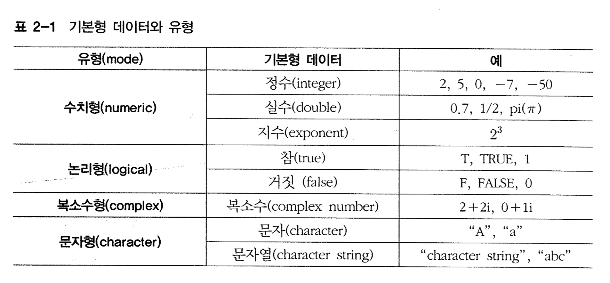

#### 유형확인

```{r}
mode(5+4)
mode(5>4)
mode(2+5i)
mode("economy")
```

#### 유형 변환
```{r}
A <- c(TRUE, FALSE, T, F, T, F)
as.numeric(A)
as.character(A)
as.complex(A)
B <- c(1,1,1,0,0,0)
as.logical(B)
as.integer(pi)
```


### 특수형 데이터와 유형

* NA(Not Available) - 데이터 수집 시 결측값(missing value), 혹은 데이터의 부재로 연산 결과를 얻을 수 없는 경우를 의미
* NaN(Not a Number) - 어떤 수학 연산의 결과로 특정한 갑을 제시해줄 수 엇는 경우
* -Inf - 음의 무한대
* +Inf - 양의 무한대
* NULL - 값이 비어 있거나 어떤 가치도 없음. (0이나 공백과 구분됨)

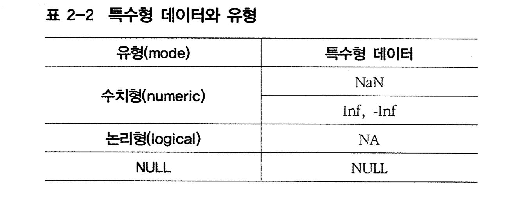


#### 특수형 데이터 유형 예제

```{r}
x <- c(1,2,3,NA,5)
y <- c(2,4,6,8,10)
x+y
0/0
Inf/1
c()
```

#### 특수형 데이터 확인하기

```{r}
x[2] <- NaN
is.na(x)
is.nan(x)
```

## 길이(Length)

* 객체의 또 다른 특성으로 길이를 고려할 수 있다.
* 예를 들어 벡터의 길이는 원소의 개수
* m x n 행렬의 길이는 행렬을 구성하는 모든 원소의 갯수 m x n 이 된다. 
* length() 함수로 확인

#### 길이 확인하기

```{r}
1:5
length(c(1:5))
G7
length(G7)
```

## 클래스(Class)

* 클래스는 객체의 원형 (붕어빵을 찍어내는 붕어빵판)
* 클래스는 객체에 포함된 데이터가 정해진 규칙대로 연산되거나 작동되도록 제어하는 역할을 한다.
* 객체는 클래스라는 속성을 가지며, 객체를 생성하는 함수의 클래스에 의해 결정된다.
* 동일한 데이터 유형을 갖더라도 자료의 배열 형태가 다르면 클래스가 달라진다.(벡터, 배열, 행렬, 데이터 프레임이 같은 데이터 유형을 가질수는 있어도 그 안의 부가정보와 규칙은 다르다)
* 제네릭 함수(generic function) - 동일한 기능을 가진 제너릭 함수를 서로 다른 클래스를 가진 객체에 각각 적용시키면 해당 클래스에 따라 함수가 객체를 처리하는 방식이 달라진다. (예- summary 함수, print 함수)
* class() 함수로 객체의 클래스를 판별가능.

#### 클래스 확인 예제

```{r}
my.mat <- matrix(1:4, nrow=2)
my.mat
mode(my.mat)
class(my.mat)
```

--------------------------------------------------------

데이터의 형태
=========================================================
* 벡터(Vecotr)
* 범주형 자료(Factor)
* 행렬(Matrix)
* 배열(Array)
* 리스트(List)
* 데이터 프레임(Data Frame)
* 경제자료의 종류와 형태
* 시계열 자료(Time Series data)
* 패널 자료(Panel Data)

--------------------------------------------------------

## 벡터(Vector)

* 하나, 혹은 그 이상의 값으로 구성된 1차원 구조.

### 벡터 생성 방법

#### c(), assign()

```{r}
x <- c(1,2,3,4)
x
assign("y", c(1,2,3,4))
y
```

#### 수열 연산자와 함수:(:)과 seq()

```{r}
-5:10
100:50
seq(from=1, to=10, by=0.5)
seq(to=5)
seq(to=10,length.06_out=15)
seq(1,2,length.06_out=10)
```

#### 반복(repeat) 함수 : rep()

```{r}
rep(c(1,2,3), times=3)
rep(1:5,each=2)
rep(G7, each=3, times=2)
```

### 벡터의 조작 방법

#### 벡터의 원소 추출 : 지표([ ]) 사용

```{r}
CPI
CPI[c(3,5,10)]
CPI[-c(1,2,3,4,5)]
CPI5Y <- CPI[6:10]
CPI5Y
CPI[CPI>90]
CPI>=90
sum(CPI>=90)
CPItmp <- CPI
CPItmp
CPItmp[2] <- NA
CPItmp
CPItmp[c(3,5,10)] <- c(80,85,90)
CPItmp
CPItmp[!is.na(CPItmp)] -> new.CPI
new.CPI
rm(CPItmp)
```

#### 벡터에 원소 추가 : append() 함수

```{r}
G7
G8 <- append(G7, "Russia")
G8
G20 <- append(G8, c("Korea", "China", "Australia", "India", "Brazil", "Mexico", "Indonesia", "Argentina", "Turkey", "Saudi Arabia", "S06_outh Africa", "EU"), after=1)  # 12개의 원소를 G8의 첫 번째 원소 뒤에 입력
G20
```

#### 벡터의 개별 원소에 이름 부여 : names() 함수

```{r}
GDP.rate <- c(5.2, 5.1, 2.3, 0.3, 6.2, 3.6)  # 경제성장률 자료 입력
GDP.rate
names(GDP.rate) <- c(2005:2010)              # 원소 이름 입력
GDP.rate[c("2009","2010")]                   # 할당된 이름으로 원소 추출
```

#### 벡터의 개별 원소에 이름을 부여 : paste() 함수- 문자결합 함수

```{r}
# 2006년부터 2011년까지 우리나라의 연도별 실업률 자료 입력
Unem.rate <- c(3.5, 3.2, 3.2, 3.6, 3.7, 3.4)
Unem.rate
names(Unem.rate) <- paste(2005:2010, "y", sep="")
Unem.rate
```

## 범주형 자료(Factor)

* 인종, 성별, 직업, 거주 지역, 결혼 여부 등과 같이 어떤 현상의 질(quality이나 특성(character)을 다루는 질적 자료 값들 -> 범주(category)로 나눠지게 된다 -> 범주형 자료
* 범주형 자료가 순서를 가지면 특별히 순서 자료라고 한다.
* R에서는 범주형 자료의 데이터 형태를 요인(factor)라고 한다. 
* 요인 자료가 순서가 있으면 순서형, 그렇지 않으면 명목형이라고 한다.

### 명목형

#### 명목형 자료의 생성 : factor()

```{r}
# 상경대학 학생 30명을 임의로 선택, 이들이 졸업 후 어떤 직장에 취직하였는지를 설문조사하여 job이라는 객체에 할당. 
# 직업군 할당 - 공무원(1), 회사원(2), 교사(3), 은행원(4), 회계사(5)
job <- c(1, 1, 4, 5, 1, 4, 5, 5, 1, 3, 2, 5, 1, 2, 4, 2, 1, 5, 3, 4, 4, 5, 1, 3, 5, 1, 4, 4, 5, 4)
job
job.f <- factor(job, levels=c(1,2,3,4,5), labels=c("Gov", "Co.staff", "Teacher", "Banker", "Acc"))
job.f
levels(job.f)
```

#### 명목형 자료의 활용 : tapply()

```{r}
# 직종별 임금 수준을 함께 조사하고 기초적 통계량을 얻어야 하는 경우, 
# 설문 대상자의 직종이 입력된 자료와 임금이 입력된 자료를 결합하고
# 평균이나 표준 편차와 같은 함수를 이용하여 통계량을 얻어야 한다.

# 1) 설문대상자 30명의 월별 임금을 순서대로 입력
incomes <- c(285, 270, 290, 310, 299, 305, 410, 380, 300, 280, 250, 520, 390, 355, 440, 371, 510, 630, 290, 410, 340, 395, 445, 300, 570, 500, 280, 354, 640, 550)
incomes
# 2) 대상이 되는 incomes 객체를 인자1, 개별 임금 관측값의 지표가 되는 job.f를 인자 2입력, 평균 통계량 함수 인자3으로 넣어줌.
# 직종별 월 임금의 평균 통계량이 계산된다.
incmean <- tapply(incomes, job.f, mean)
incmean
# 3) 직종별 월 임금의 표준편차 구하기.
incsd <- tapply(incomes, job.f, sd)
incsd
```

### 순서형

* 순서형 자료(ordered factor)는 각 레벨(level)에 순서를 부여하여 정리.
* factor() 함수의 ordered 인자에 T 입력
* 혹은 ordered() 함수 이용 가능

#### c(), assign()

```{r}
# 직장의 종류와 임금 수준에 대한 조사와 더불어, 이들 30명의 직장 만족도 조사
# 만족의 정도 - 낮음(1), 보통(2), 높음(3)
ans.satis <- c(3, 2, 2, 1, 1, 1, 3, 3, 3, 2, 2, 2, 1, 1, 1, 3, 3, 2, 3, 1, 2, 3, 2, 1, 1, 3, 3, 3, 1, 2)
ans.satis
ans.satisf <- factor(ans.satis, levels=c(1,2,3), labels=c("low", "middle", "high"), ordered=T)
ans.satisf
ans.satisor <- ordered(ans.satis, level=c(1,2,3), label=c("low", "middle", "high"))
ans.satisor
names(ans.satisor) <- paste("person", 1:30, paste="")
ans.satisor
```

## 행렬(Matrix)

## 행렬의 생성 방법

#### 행렬의 생성 : matrix() 함수

```{r}
matrix(c(1,2,3,4))
matrix(c(1,2,3,4), ncol=2)
matrix(1:9, nrow=3, byrow=T)
matdata <- c(1,2,3,4)
matrix(matdata, ncol=2, dimnames=list(c("row1", "row2"), c("col1", "col2")))
```

#### 행렬의 생성 : rbind() 함수와 cbind() 함수 

```{r}
# 부분시장 균형 모형이 다음과 같다고 하자
# Q_d = Q_s
# Q_d = 10 - 2P
# Q_s = -5 + 3P

# 이때 3개의 변수를 Q_d, Q_s, P의 순서대로 배열한다면
# Q_d - Q_s      = 0            ----------- (1식)
# Q_d       + 2P = 10           ----------- (2식)
#       Q_s - 3P = - 5          ------------(3식)

# 따라서 위 모형의 계수행렬은 rbind() 함수를 사용하여 생성할 수 있다.
row1 <- c(1,-1,0)
row2 <- c(1,0,2)
row3 <- c(0,1,-3)
coef.mat <- rbind(row1, row2, row3)
coef.mat
```

#### cbind() 함수로도 생성할 수 있다.
```{r}
col1 <- c(1, 1, 0)
col2 <- c(-1, 0, 1)
col3 <- c(0, 2, -3)
coef.mat1 <- cbind(col1, col2, col3)
coef.mat1
```

### 행렬의 조작 방법

#### 행렬의 원소 추출 : 지표([,]) 사용
```{r}
coef.mat[3,3]
coef.mat[3,]
coef.mat[1:2,]
coef.mat[-2,]
coef.mat[c("row1", "row3"),]
coef.mat[,c(T,T,F)]
coef.mat[coef.mat==1]
coef.mat==1
coef.mat -> mat.tmp
mat.tmp[,3] <- 5
mat.tmp
mat.tmp[mat.tmp==1] <- 0
mat.tmp
cbind(mat.tmp, 1:3)
rbind(mat.tmp,1)
rbind(mat.tmp[1,], c(2,4,6), mat.tmp[2:3,])
```

#### 행렬의 원소 추출 : 지표행렬 사용
```{r}
A <- matrix(1:36,nrow=6)
A
i.mat <- matrix(c(2,3,4,1,4,4,5,6),ncol=2, byrow=T)
i.mat
dimnames(i.mat) <- list(c("index1", "index2", "index3", "index4"), c("row","col"))
i.mat
A[i.mat]
A[i.mat] <- c(3,4,6,8)
A
```

## 배열(Array)

* 배열은 동일한 유형의 원소로 이루어진 데이터 구조
* 여러 개의 차원으로 구성될 수 있따.
* 벡터와 행렬은 배열의 일종

#### 1차원 배열의 예

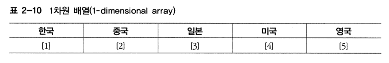

#### 2차원 배열의 예

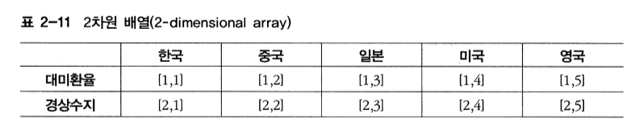

#### 3차원 배열의 예

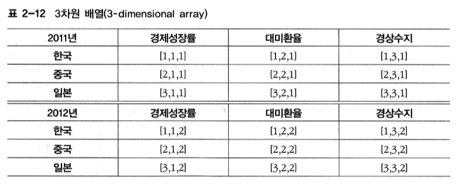

### 배열의 생성 방법

#### 배열 생성을 위한 R 함수 : array()
```{r}
arr <- array(1:18, dim=c(3,3,2), dimnames=list(c("KOR","CHI","JAP"), c("GDP.R", "USD.R", "Cuur.Acc"), c("2011Y", "2012Y")))
arr
arr1 <- 1:18
dim(arr1) <-c(3,3,2)
dimnames(arr1) <- list(c("KOR","CHI","JAP"), c("GDP.R", "USD.R", "Cuur.Acc"), c("2011Y", "2012Y"))
arr1
arr1==arr
```


### 배열의 조작 방법

#### 배열의 조작 방법 예제
```{r}
arr
arr[1,,]
arr[,-2,]  # 마이너스 지표는, 삭제를 의미
arr[,,2]
arr[,,"2012Y"]
arr[c(T,T,F),,2]
```

#### 배열 원소의 추출 밎 수정
```{r}
arr -> arr.tmp
arr.tmp
arr.tmp[,,1] <- c(5,6,4)
arr.tmp
arr.tmp[,1,2] <- NA
arr.tmp
arr.tmp[is.na(arr.tmp)] <- c(8,5,2)
arr.tmp
```

## 리스트(List)

* 리스트는 여러 가지 유형을 가진 객체들의 집합(비교하자면,벡터는 동일한 유형으로만 이뤄져야 한다)
* 리스트를 이루는 객체를 성분(component)라고 한다.

### 리스트의 생성 방법

#### 리스트 생성방법 예제
```{r}
# 1) 한국은행에서 수집한 분기별 대미환율(2010.1/4~2012.1/4, 단위 : 원) 자료
ex.rate <- c(1144, 1166, 1185, 1134, 1120, 1084, 1084, 1145, 1131)
ex.rate
# 2) 분기별 경상수지(2010.1/4~2012.1/4, 단위 : 백만 달러) 자료
blc.ca <- c(68, 10735, 10122, 8469, 2610, 5492, 6896, 11507, 2631)
blc.ca
# 3) 위 자료들을 하나의 묶어 list로 할당
trade.kor <- list(country="Korea", KRW.USD=ex.rate, balance=blc.ca)
trade.kor
mode(trade.kor)
attributes(trade.kor)
length(trade.kor)
```

### 리스트의 조작 방법

#### 리스트의 성분과 원소 조작 : 대괄호 연산자([ ]) 사용
```{r}
# 성분 추출은 [[]] 사용
# 성분에 포함된 원소 추출은 []
trade.kor[[1]]
trade.kor[[2]]
trade.kor[[3]][2]
```
#### 리스트의 성분과 원소 조작 : 성분추출 연산자($) 사용
```{r}
trade.kor$country
trade.kor$balance[2]
trade.kor$KRW.USD[c(2,3,6)]
```

#### 리스트의 성분과 원소 조작 : 성분의 추가와 삭제 
```{r}
# 네 번째 성분으로, 같은 시기의 분기별 경제성장률(2010.1/4~2012.1/4, 단위 : %) 추가해보자
GDP.growth <- c(2.1, 1.4, 0.6, 0.5, 1.3, 0.9, 0.8, 0.3, 0.9)
trade.tmp <- trade.kor
trade.tmp
trade.tmp[4] <- GDP.growth
names(trade.tmp)[[4]] <- "GDP.growth.rate"
trade.tmp
trade.tmp$GDP.growth.rate
trade.tmp$GDP.growth.rate <- NULL
trade.tmp
```

## 데이터 프레임(Data Frame)

* 데이터 프레임은 리스트의 특수한 형태다
* 2개의 차원으로 이루어져 있다.
* 리스트와 마찬가지로 데이터 프레임을 구성하는 각 변수는 서로 다른 형태의 데이터를 가질 수 있다.
* 다만 데이터 프레임은 모든 변수의 길이가 같아야 한다(리스트는 그럴 필요가 없다)

### 데이터 프레임의 생성 방법

#### 데이터 프레임을 생성하기 위한 R 함수 : data.frame()

```{r}
# 대미환율(ex.rate), 경상수지(blc.ca), 경제성장률(GDP.growth) 자료 사용
# 대미환율
str(ex.rate)
# 경상수지
str(blc.ca)
# 경제성장률
str(GDP.growth)
# 데이터 프레임 구성
trade.df <- data.frame(ex.rate, blc.ca, GDP.growth, row.names=c(paste(rep(2010:2012, each=4, length.out=9), paste(1:4, 4, sep="/"), sep=".")))
# 속성 확인
attributes(trade.df)
# 길이 확인
length(trade.df)
# 구조 요약확인
str(trade.df)
# 앞에 몇 개 데이터만 보기
head(trade.df)
# 데이터 요약통계 보기
summary(trade.df)
```

### 데이터 프레임의 조작 방법

#### 데이터 프레임의 원소 조작 : 대괄호([ ]) 연산자와 성분추출($) 연산자

```{r}
head(trade.df)
# 1행 전체, 즉 2010년 1/4분기의 대미환율, 경상수지, 경제성장률 관측값 추출
trade.df[1,]
# 세 번째 변수의 1행과 5행, 9행의 원소 - 즉 2010, 2011, 2012년도 1/4분기의 경제성장률 관측값 추출
trade.df[c(1,5,9), 3]
# 첫 번째 변수와 세 번째 변수, 즉 대미환율 변수와 경제성장률 변수 전체를 추출
trade.df[,c(T,F,T)]
# 세 번째 변수인 경제성장률 변수를 추출
# 데이터 프레임도 리스트이므로, 성분 추출 연산자 [[]] 적용 
trade.df[[3]]
# 첫번째 변수의 첫 번째 원소, 즉 2010년 1/4분기의 대미환율 관측값 추출
trade.df[[1]][1]
# 세 번째 변수의 관측값들 중에서 1 이상의 값을 가지는 행을 추출 -> 경제성장률이 1% 이상인 분기를 학인
trade.df[trade.df[[3]]>=1,]
# 성분추출 연산자 $
trade.df$ex.rate
trade.df$GDP.growth[c(1,2,9)]
trade.df[trade.df$blc.ca>=10000,2]
```


#### 데이터 프레임의 원소 조작 : attach() 함수와 detach() 함수 

```{r}
# 5명 학생 데이터 - 이름, 나이, 성별, 전공 변수로 구성.
student <- data.frame(name=letters[1:5], age=c(22,23,21,20,25), sex=c("m", "m", "f", "f", "f"), major=c("eco", "math", "eng", "eco", "art"), stringsAsFactors=F)
student
search()
attach(student)
search()
ls(2)
sdt.tmp <- student
sdt.tmp
major
major[c(3,4)] <- c("jab", "acc")
sdt.tmp[,4] <- major
sdt.tmp
detach(student)
search()
```
  

R의 주요 연산자와 함수
=========================================================
* 주요 연산자
* 주요 수학 및 통계함수

## 주요 연산자

### 산술 연산자


```{r}
7 + 3
```

```{r}
15 - 5
```

```{r}
100 / 4
```

```{r}
2^3
```

```{r}
2**3
```

```{r}
# 나눗셈의 몫
7%/%3 
```

```{r}
# 나눗셈의 몫
7%%3
```


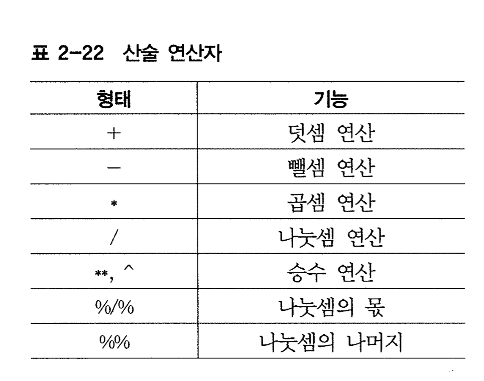

### 관계 연산자


```{r}
a <- c(2, 4, 6, 8, 10)
a
b <- c(2, 3, 5, 8, 9)
b
c <- matrix(c(1,2,3,4), ncol=2)
c
d <- matrix(c(1,4,3,2), ncol=2)
d
```

```{r}
a == b
a != b
c >= d
c > d
```

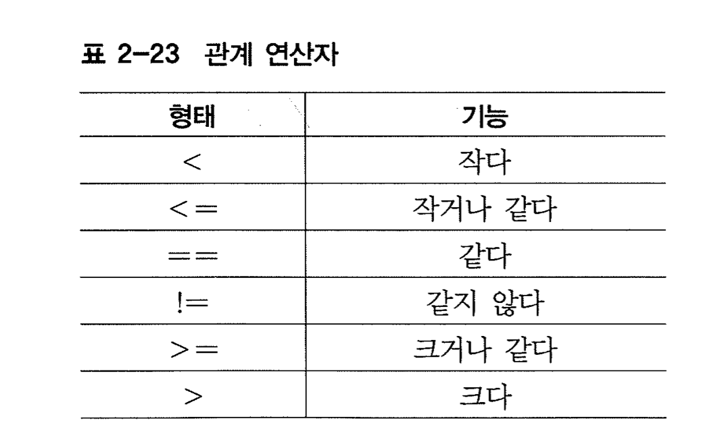

### 논리 연산자


```{r}
X <- c(T, F, F, T, T)
X
Y <- c(2, 0, 1, 0, 1)
Y
X&Y  # 모든 원소에 대하여
X&&Y # 첫 번째 원소에 대하여
X|Y
X||Y
```


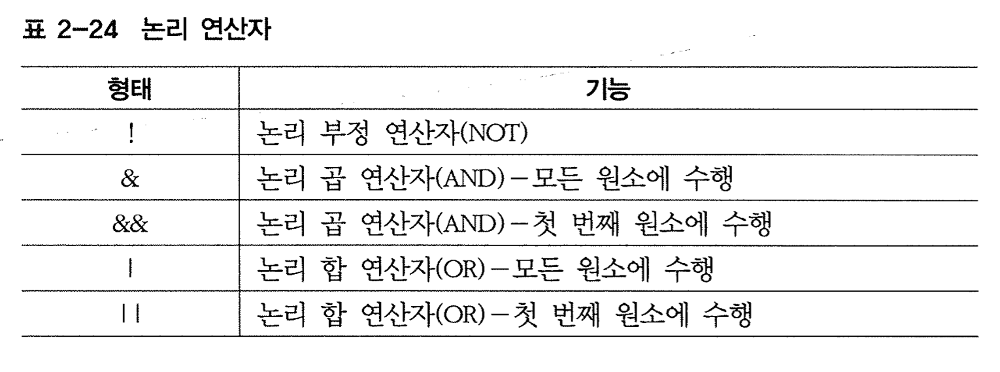
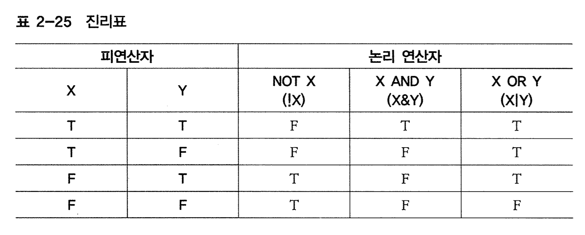

## 주요 수학 및 통계함수

### 주요 수학함수


```{r}
a <- c(-3, -2, -1, 1, 1, 2, 3)
a
sum(a)
abs(a)
sqrt(a)
max(a)
min(a)
prod(a)
range(a)
sign(a)
ceiling(2.75)
ceiling(-2.75)
floor(2.75)
floor(-2.75)
trunc(2.75)
trunc(-2.75)
round(pi)
round(pi, digits=3)
```


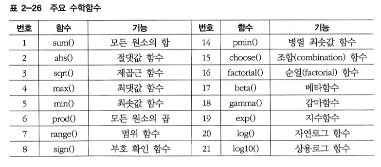
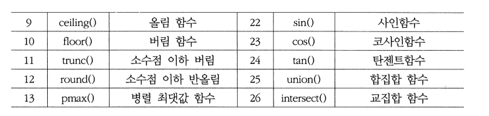

### 주요 통계함수 

#### 기본적인 통계량을 반환하는 함수


```{r}
X <- c(20, 6, 10, 7, 15, 3, 2, 30, 28)
X
mean(X)
sort(X)
sort(X, decreasing=T)
median(X)
quantile(X) # 분위수
diff(range(X)) # 범위(최댓값-최솟값)
var(X)
sd(X)
summary(X)
```

```{r}
X
Y <- c(-1, 3, -4, 7, -9, 7, -1, -9, 3)
Y
cov(X,Y)
cor(X,Y)
cumsum(1:10) # 누적 합
cumprod(1:10) # 누적 곱
```

```{r}
df.xy <- data.frame(col1=X, col2=Y, row.names=c(paste("row", 1:9)))
df.xy
mean(df.xy$col1)
rowMeans(df.xy)
colMeans(df.xy)
```


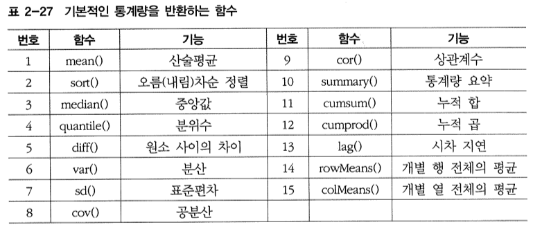

#### 확률분포와 관련된 통계함수 


```{r}
# 수익률 mu=30%, sigma=10%인 정규분포에서 수익률이 60%보다 낮을 확률?
pnorm(60,mean=30, sd=10) 

# 수익률 mu=30%, sigma=10%인 정규분포에서 수익률이 60%보다 높을 확률?(표준화)
1 - pnorm(3,0,1) 

# t-통계량이 -4.314, n=15일 때 p-value?
pt(-4.314, 14)

# mu=30, sigma=10인 정규난수 50개 생성
round(rnorm(n=50, mean=30, sd=10), digits=2)
```

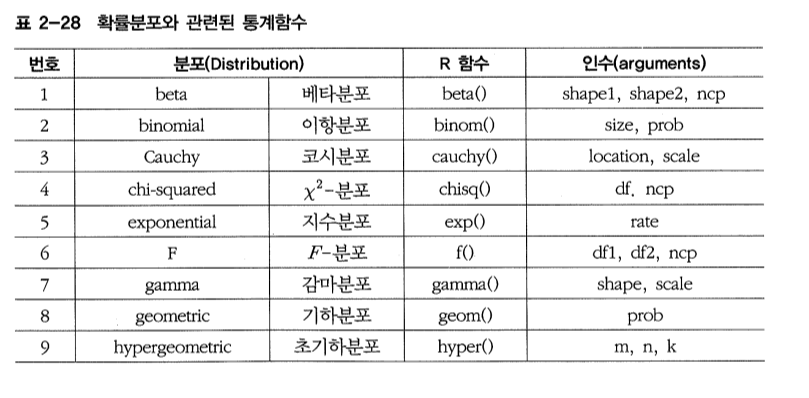
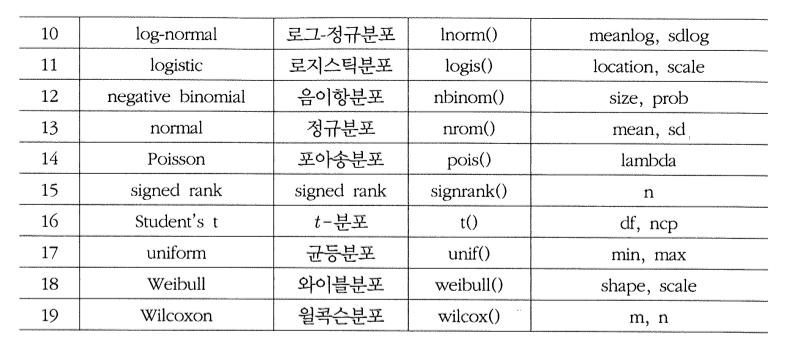

#### 확률분포 접두사

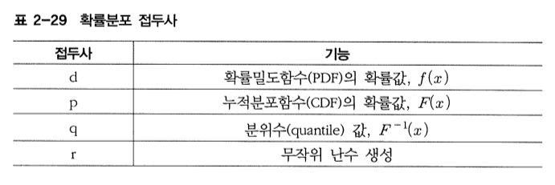

--------------------------------------------------------

자료의 입력 및 출력
=========================================================
* 텍스트 파일의 입력 및 출력
* 엑셀 파일의 입력 및 출력

## 텍스트 파일의 입력 및 출력

### 텍스트 파일로부터 자료 불러오기

#### 텍스트 파일 불러오기 : scan() 함수
```{r}
# 문자형 자료 예제 - 데이터 전체 불러오기
scan(file="./06_data/input.sample.txt", what="")
# 첫 번째 행의 자료 선택
scan(file="./06_data/input.sample.txt", what="", nline=1)
# 첫 번째 행의 자료 제외
scan(file="./06_data/input.sample.txt", what="", skip=1)
# 수치형 자료 예제 - 데이터 전체 불러오기
scan(file="./06_data/input.sample0.txt", what="")
# 3행과 4행의 데이터를 불러온 후 5x2 행렬 생성
text.mat <- matrix(scan(file="./06_data/input.sample0.txt", skip=2), nrow=5, dimnames=list(1:5, c("X", "Y")))
text.mat
```


#### 파일에 입력된 테이블 자료를 R에 불러오는 함수 : read.table()
```{r}
# 한국은행 경제통계시스템(ecos.bok.or.kr)에서 수집한 
# 2011년 1월부터 2012년 1월까지의 
# 월별 코스피(KOSPI)지수와 코스닥(KOSDAQ) 지수 자료

# 파일 경로를 입력하여 데이터 전체 불러오기
read.table(file="./06_data/input.sample1.txt")
# 첫 줄 변수이름 사용 옵션
sample1 <- read.table(file="./06_data/input.sample1.txt", header=T)
str(sample1)
head(sample1)
sample1$KOSPI
sample1$KOSDAQ
# 첫 줄 변수이름 사용 옵션, 첫 번째 열을 행 이름으로 사용
sample1 <- read.table(file="./06_data/input.sample1.txt", header=T, row.names=1)
str(sample1)
head(sample1)
sample1$KOSPI
sample1$KOSDAQ

# 수치형과 문자형이 혼합되어 있으며
# 결측값 NA가 포함되어 있고
# 각 데이터가 쉼표로 구분되어 있는 경우
# 계량경제학을 수강하는 학생 7명의 이름과 성별, 나이, 중간시험 성적 데이터가 입력된 자료
sample2 <- read.table(file="./06_data/input.sample2.txt",         # 파일 로드
                  sep=",", row.name=paste("p", 1:7, sep="."),  # 구분기호, 행 이름 입력
                  col.names=c("name", "sex", "age", "score"),  # 열(변수) 이름 입력
                  stringsAsFactors=F)                          # 범주자료 자동 변환 제한
str(sample2)
sample2
sum(sample2$age)
sample2$name
sample2$sex
```


### 텍스트 파일로 자료 보내기

#### 연산 결과를 실시간으로 파일에 저장하는 R 함수 : sink()
```{r}
# 벡터 생성
x <- c(10, 13, 56, 66, 74, 12, 41, 74, 85, 61)
# 파일 생성 및 연결
sink(file="./06_data/output.sample.txt")
# 평균값 저장
mean(x)
# 표준편차 값 저장
sd(x)
# 요약통계량 저장
summary(x)
# 연결 종료
sink()

# 이미 생성된 파일에 추가로 결과물 저장
# 첨부모드로 연결, 콘솔 출력 옵션 선택
sink(file="./06_data/output.sample.txt", append=T, split=T)
# 벡터 출력, 저장
x
# 새로운 벡터 생성, 출력, 저장
(y<-1:10)
# 공분산 결과 출력, 저장
cov(x,y)
# 상관계수 출력, 저장
cor(x,y)
# 연결종료
sink()
```

#### 벡터 자료를 파일에 저장하는 R 함수 : cat()
```{r}
# 난수 생성
ts <- round(rnorm(30, 100, 10))
# 원소 이름 입력
names(ts) <- paste(1982:2011, "Y")
# 객체 ts의 데이터를 "output.sample0.txt"에 저장
cat(ts, file="./06_data/output.sample0.txt",
    sep=".",     # 구분기호는 마침표.
    fill=T)      #텍스트 파일의 활성창(window) 크기에 맞춰서 자동으로 줄 바꿈
```


#### 테이블 구조의 자료를 파일에 저장하는 R 함수 : write.table()
```{r}
# sample1을 "output.sample1.txt"에 저장하기
write.table(sample1, file="./06_data/output.sample1.txt", row.names=F)
# sample2를 "06_output.sample2.txt"에 저장하기
write.table(sample2, file="./06_data/output.sample2.txt")
```


--------------------------------------------------------

제어문, 연산, 함수
=========================================================
* IF, FOR, WHILE문
* 함수의 정의
* 스코프
* 값에 의한 전달
* 객체의 불변성
* 객체의 삭제
* 익명 함수(람다함수)[3]

## IF, FOR, WHILE문

```{r}
# if - else
if(TRUE) {
  print('TRUE')
  print('hello')  
} else {
  print('FALSE')
  print('world')
}
```

```{r}
# for
for (i in 1:10) {
  print ( i )
}
```

```{r}
# while
i <- 0
while (i < 10) {
  print(i)
  i <- i + 1
}
```

## 함수의 정의

* 함수명 <- function(인자, 인자, ....) { 함수 본문 }

```{r}
fibo <- function(n) {
  if (n==1 || n==2) {
    return(1)
  }
  return(fibo(n-1) + fibo(n-2))
}

fibo(1)
fibo(5)
```

```{r}
# return문이 없어도 되지만 가능하면 적어주자.
f <- function(x, y) {
  print(x)
  print(y)  
}

f(1, 2)

# 인자 이름을 사용하면 입력 순서를 다르게 해도 된다.
f(y=1, x=2)
```

```{r}
# 함수를 인자로 넘길 수 있다.
f <- function(x, y, some_func) {
  return(some_func(x,y))
}

g <- function(x, y) {
  return(x+y)
}

f(3,4,g)
```

```{r}
# 함수 안에 함수 정의 가능(중첩함수)
f <- function(x, y) {
  print(x)
  g <- function(y) {
    print(y)
  }
  g(y)
}

f(1,2)
```

## 스코프
* lexical scope(또는 static scope라고 함)

### 콘솔(혹은 스크립트 파일)에서 변수 선언하면 모든 곳에서 사용 가능한 변수가 된다.(전역변수)

```{r}
n <- 1

f <- function() {
  print(n)
}

f()

n <- 2
f()
```

### 지역변수. (함수 내부 같은 이름 변수가 우선한다)

```{r}
n <- 100
f <- function() {
  n <- 1
  print(n)
}

f()
```

### 함수 내부에서 전역 변수에 접근하기. <<- 연산자

```{r}
b <- 0
f <- function() {
  a <- 1
  g <- function() {
    a <<- 2
    b <<- 2
    print(a)
    print(b)
  }
  
  g()
  print(a)
  print(b)
}

f()
```

## 값에 의한 전달
* R에서는 값에 의한 전달을 사용한다(Call By Value)

```{r}
f <- function(df2) {
  df2$a <- c(1, 2, 3)  
  df2
}

df <- data.frame(a=c(4, 5, 6))
df

f(df)
df
```

## 객체의 불변성
* R의 객체는(거의 대부분의 경우에) 불변이다(이뮤터블immutable)

```{r}
# 이 코드는 객체를 수정하는 것처럼 보이지만 실제로는 그렇지 않다.
a <- list()
a
a$b <-c(1, 2, 3)
a
```

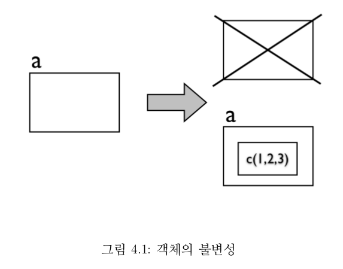

```{r}
# 벡터 연산이 for 문보다 효율적인 이유도 객체가 불변이라는 점 때문이다.
# for 문 안에서 벡터의 인자를 하나씩 바꾸는 코드는 v[i] 값을 1씩 증가시킬때마다 
# i번째 값이 수정된 벡터를 매번 새로 만들고 이를 매번 v에 할당한다.
# 따라서 1000개의 새로운 객체를 생성하는 비효율이 발생한다.
v <- 1:1000
v[1:5]
for (i in 1:1000) {
  v[i] <- v[i] + 1  
}
v[1:5]
````

```{r}
# 벡터 연산
# 이 코드는 v내 전체 값을 1만큼 증가시킨 객체를 한개 만든 다음 이를 v에 다시 할당한다.
v <- 1:1000
v[1:5]
v <- v + 1
v[1:5]
```

### 객체의 삭제

* 메모리 상에 만들어진 객체의 목록을 얻는 함수는 ls()이다.
* rm() 함수를 이용해서 객체를 삭제할 수 있다.

```{r}
# xxx라는 이름의 객체를 생성하고 메모리상에 존재하는지 확인
xxx <- c(1, 2, 3, 4, 5, 6)
ls()
```

```{r}
# xxx 객체 메모리에서 삭제
rm("xxx")
ls()
```

```{r}
# 한번에 모두 삭제
rm(list=ls())
ls()
```

## 익명 함수(람다함수)

```{r}
z <- matrix(c(1,2,3,4,5,6), nrow=3)
z
```
```{r}
# 일반적인 함수 방식
f <- function(x) {
  x/c(2,8)
}
y <- apply(z, 1, f)
y
```

```{r}
# 익명 함수
y <- apply(z, 1, function(x) {x/c(2,8)})
y
```
--------------------------------------------------------

클래스
=========================================================

* S3 클래스
* S3 클래스 작성하기

## S3 클래스
* S3 라는 클래스 구조를 주로 사용한다. 
* S3 클래스는 클래스 이름 속성과 '할당dispatch' 능력이 추가된 리스트로 돼어있다.
* 다형성을 지원하기 위해 '제네릭 함수' 개념이 있다. plot()이나 print() 같은 함수가 그 예.


## S3 클래스 작성하기

### 클래스 작성

```{r}
j <- list(name="Joe", salary=5000, union=T)
class(j) <- "employee"
attributes(j) # 확인해보자
```

### 기본 print() 함수 사용 예

```{r}
# 기본적으로 출력용으로는 j는 리스트로 인식된다
j
```

```{r}
# 출력 메소드 직접 작성
print.employee <- function(wrkr) {
  cat(wrkr$name, "\n")
  cat("salary", wrkr$wrkr, "\n")
  cat("union member", wrkr$union, "\n")
}

# 이제는 emplyee 클래스 객체에 대해 print()를 그냥 호출해도 자동으로 print.employee()로 연결될 것이다.
# 다음과 같이 공식적으로 확인 가능
methods(, "employee")

# 출력해보자
j
```

### 상속

```{r}
# 시간제 직원 클래스
k <- list(name="Kate", salary=68000, union=F, hrsthismonth=2)
class(k) <- c("hrlyemployee", "employee")

# 출력. print.employee를 상속받았기에 똑같이 동작한다. 
k
```

-------------------------------

apply 함수들
=========================================================
* apply
* lapply
* sapply
* tapply
* mapply

## apply()

* apply() 는 행렬의 행 또는 열방향으로 특정 함수를 적용하는데 사용되며, apply(행렬, 방향, 함수) 형태로 호출한다. 
* 이때 ‘방향’은 1이 주어지면 행, 2가 주어지면 열을 뜻한다. 
* apply()를 수행한 결과값은 벡터, 배열, 리스트 중 적합한 것으로 반환된다

```{r}
sum (1:10)

d <- matrix (1:9 , ncol =3)
d

# 행방향
apply (d , 1 , sum )

# 열방향
apply (d , 2 , sum )

# iris 데이터 사용
data(iris)
head(iris)
str(iris)
summary(iris)

head(iris[,1:4])

apply(iris[,1:4], 2, sum)
```

## lapply()
* lapply()는 lapply(X, 함수)의 형태로 호출하며 이때 ‘X’는 벡터 또는 리스트이고, ‘함수’는 ‘X’내의 각 요소에 적용할 함수이다. 
* 함수를 적용한 결과는 리스트로 반환된다.

```{r}
result <- lapply (1:3 , function ( x ) { x * 2 })
result

# 데이터 프레임에 바로 적용하기
lapply ( iris [ , 1:4] , mean )
```

## sapply()
* sapply()는 lapply()와 유사하지만 리스트대신 행렬, 벡터 등으로 결과를 반환하는 함수이다.
* 입력으로는 벡터, 리스트, 데이터 프레임등이 쓰일 수 있다.

```{r}
# lapply는 리스트로 반환
lapply ( iris [ , 1:4] , mean )

# sapply는 벡터를 반환
sapply ( iris [ , 1:4] , mean )
```

## tapply
* tapply()는 그룹별 처리를 위한 apply 함수로서 tapply(데이터, 색인, 함수)의 형태로 호출한다.
* 여기서 ‘색인’은 데이터가 어느 그룹에 속하는지를 표현하기 위한 factor 형 데이터이다. 
* 즉, tapply는 데이터가 주어졌을때 각 데이터가 속한 그룹별로 주어진 함수를 수행한다.

```{r}
# 모두 한그룹
1:10
rep(1,10)
tapply (1:10 , rep (1 , 10) , sum )

# 홀수별, 짝수별로 묶어보자ㅓ
1:10
1:10 %% 2 == 1
tapply (1:10 , 1:10 %% 2 == 1 , sum )
```

## mapply
* mapply()는 sapply()와 유사하지만 다수의 인자를 함수에 넘긴다는데서 차이가 있다.

```{r}
mapply ( mean , iris [1:4])
```

---------------------------

기타 자주 쓰는 유용한 함수들 
==============================================
* subset() 
* stack(), unstack()


## subset()

* 특정 부분만 뽑아낸다

```{r}
head(iris)
head(iris$Species)

subset(iris, Species == "setosa")

subset(iris , Species == "setosa" & Sepal.Length > 5.0)

subset(iris , select = c(Sepal.Length ,Species))
```

## stack(), unstack()

### stack()

```{r}
x <- data.frame(medicine = c("a", "b" , "c" ),
                ctl = c(5 , 3 , 2),
                exp = c(4, 5 , 7))
x

stacked_x <- stack(x)
stacked_x

# install.pacakges("doBy")
library(doBy)
summaryBy(values ~ ind, stacked_x)
```

### unstack()

```{r}
unstack(stacked_x, values ~ ind)
```

-------------------------------

참고문헌
========================================================
 * [1] 응용 계량경제학 - R 활용 - http://www.kyobobook.co.kr/product/detailViewKor.laf?mallGb=KOR&ejkGb=KOR&barcode=9788968660696
 * [2] R을 이용한 데이터 분석 실무 - http://r4pda.co.kr/
 * [3] 빅데이터 분석 도구 R 프로그래밍 - http://www.aladin.co.kr/shop/wproduct.aspx?ISBN=8960773336

